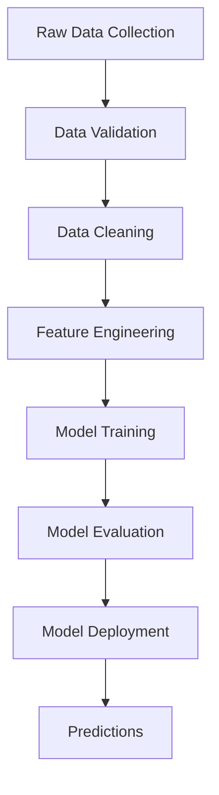

# Data Lineage Documentation

## Overview

This document outlines the data flow and transformations in the Drinking Water Quality Prediction system, from initial data collection to final predictions.

## Data Flow Overview

## 1. Data Sources

### 1.1 Raw Data

- Source: Water quality monitoring stations
- Format: CSV files
- Frequency: Daily measurements
- Location: `data/raw/`

### 1.2 External Data

- Weather data
- Geographic information
- Historical water quality records

## 2. Data Processing Pipeline

### 2.1 Data Collection

- Automated collection from monitoring stations
- Manual data entry for specific measurements
- Data format standardization

### 2.2 Data Validation

- Automated quality checks (`scripts/quality_checks.py`)
- Range validation for each parameter:
  - pH: 0-14
  - Iron: ≥ 0 mg/L
  - Nitrate: ≥ 0 mg/L
  - Chloride: ≥ 0 mg/L
  - Lead: ≥ 0 mg/L
  - Zinc: ≥ 0 mg/L
  - Turbidity: ≥ 0 NTU
  - Fluoride: ≥ 0 mg/L
  - Copper: ≥ 0 mg/L
  - Sulfate: ≥ 0 mg/L
  - Conductivity: ≥ 0 µS/cm
  - Chlorine: ≥ 0 mg/L
  - Total Dissolved Solids: ≥ 0 mg/L
  - Water Temperature: -50 to 100°C
  - Air Temperature: -50 to 100°C

### 2.3 Data Cleaning

- Outlier detection and handling
- Missing value imputation
- Data normalization
- Feature scaling

### 2.4 Feature Engineering

- Creation of derived features
- Feature selection
- Dimensionality reduction

## 3. Model Development

### 3.1 Training Data

- Source: Processed and cleaned data
- Location: `data/processed/`
- Split: 80% training, 20% testing

### 3.2 Model Training

- Multiple model types:
  - Random Forest
  - XGBoost
  - LightGBM
  - Decision Tree
  - Linear SVC
- Hyperparameter tuning
- Cross-validation

### 3.3 Model Evaluation

- Performance metrics:
  - Accuracy
  - Precision
  - Recall
  - F1 Score
- Model comparison
- Validation on test set

## 4. Deployment Pipeline

### 4.1 Model Deployment

- Model serialization
- API development
- Integration with web interface

### 4.2 Monitoring

- Performance monitoring
- Data drift detection
- Model retraining triggers

## 5. Data Storage

### 5.1 Raw Data

- Original measurements
- Metadata
- Collection logs

### 5.2 Processed Data

- Cleaned datasets
- Feature matrices
- Training/test splits

### 5.3 Model Artifacts

- Trained models
- Preprocessing pipelines
- Evaluation metrics

## 6. Version Control

### 6.1 Data Versions

- Raw data versioning
- Processed data versioning
- Model versioning

### 6.2 Code Versions

- Script versioning
- Configuration versioning
- Documentation versioning
